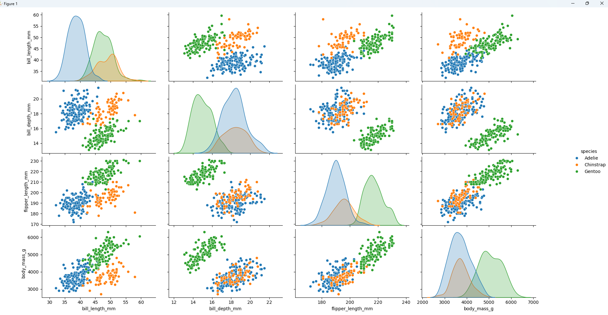

# Penguins-research

## Description
This app uses seaborn for data visualisation. The code will load the penguins dataset from seaborn and create a pairplot to visualize pairwise relationships between variables, with different species represented by different colors.
## Table of Contents
- [Penguins-research](#penguins-research)
  - [Description](#description)
  - [Table of Contents](#table-of-contents)
  - [Installation](#installation)
  - [Usage](#usage)
  - [License](#license)
  - [Contributing](#contributing)
  - [Credits](#credits)
  - [Tests](#tests)
  - [Questions](#questions)

## Installation
pip install pandas
pip install jupyter
pip install seaborn
pip install matplotlib

## Usage

A screenshot of the paitplots shown here:

The repository can be accessed using this link:https://github.com/Mikemupararano/penguins-research.

## License
This application is covered under the MIT license.

## Contributing
 N/A

## Credits
https://seaborn.pydata.org/installing.html
https://seaborn.pydata.org/generated/seaborn.pairplot.html
## Tests
N/A

## Questions
For any questions or concerns, please contact me at [kudath@yahoo.co.uk](mailto:kudath@yahoo.co.uk).
You can also find me on GitHub: [https://github.com/Mikemupararano](https://github.com/https://github.com/Mikemupararano)
